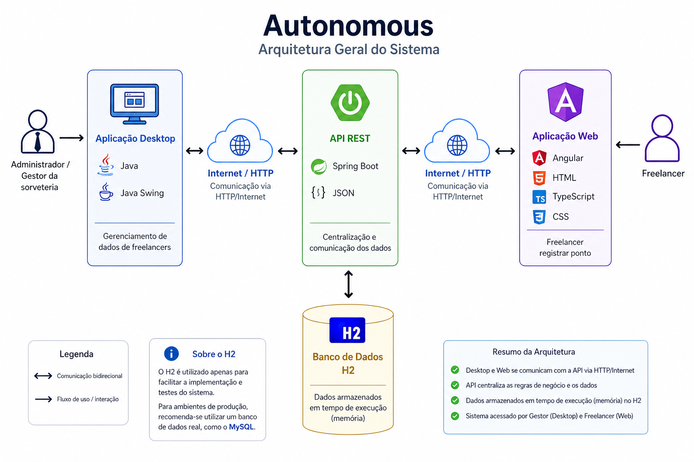

# Autonomous API

Este repositório contém uma API desenvolvida com spring para gestão de freelancers da sorveteria Bachir Ice Cream. A API faz parte de uma solução acadêmica desenvolvida no 5º semestre da faculdade, com o objetivo de atender uma demanda real de uma comunidade externa à instituição de ensino. A API permite centralizar informações de freelancers e escalas, facilitando o controle de atividades, organização e apoio à operação do negócio.

---

### Estrutura do Projeto

| Pacote               | Responsabilidade                                                                                                                                                                                                                                                                              
|:---------------------|:----------------------------------------------------------------------------------------------------------------------------------------------------------------------------------------------------------------------------------------------------------------------------------------------|
| **`configurations`** | Configurações da API                                                                                                                                                                                                                                                                          |
| **`controllers`**    | Intermediam as requisições externas, organizando o fluxo e delegando as ações para os serviços apropriados.                                                                                                                                                                                   |
| **`dtos`**           | Objetos utilizados para transportar dados entre camadas e na comunicação externa.                                                                                                                                                                                                             |
| **`entities`**       | Representações das entidades de domínio.                                                                                                                                                                                                                                                      |
| **`enums`**          | Definição de constantes tipadas para controle de valores fixos e padronização de regras.                                                                                                                                                                                                      |
| **`exceptions`**     | Classes responsáveis pelo tratamento e representação de exceções da API.                                                                                                                                                                                                                      |
| **`mappers`**        | Responsáveis pela conversão e transformação de objetos entre diferentes modelos da API, como DTOs e entidades, utilizando o MapStruct para automatizar o mapeamento.                                                                                                                          |
| **`repositories`**   | Camada de acesso a dados responsável pela persistência, consulta e manipulação de entidades no banco de dados, utilizando Spring Data JPA.                                                                                                                                                    |
| **`services`**       | Contêm as regras de negócio, coordenando operações e aplicando validações.                                                                                                                                                                                                                    |

---

### Como Executar a API

#### Pré-requisitos

* Java JDK 21 ou superior
* IDE (IntelliJ, Eclipse ou VS Code)

#### Passos

1. Baixe o projeto
2. Abra o projeto na sua IDE
3. Localize a classe principal (AutonomousApiApplication.java)
4. Execute a API

---

### Outros Componentes da Solução

Esta API faz parte de uma solução completa que inclui:

* Programa: https://github.com/FeMartins2002/Faculdade-Autonomous-Desktop
* Web: 
